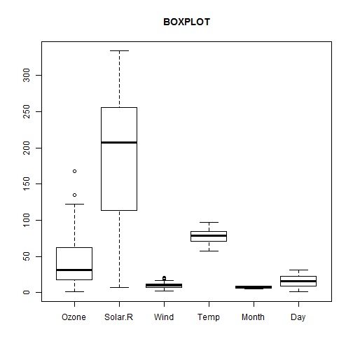
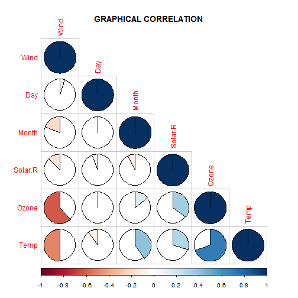

BP, GC and PCA
===
author: Eugenio Del Prete
date: nov 24 2014
transition: zoom
font-family: 'calibri'

<small>
Developing Data Products Course Project
 
Data Science Specialization
 
Johns Hopkins University - _Coursera_
</small>

Basic Exploratory Data Analysis (BEDA)
===

Simple workflow steps:

1. think about the **problem** to solve
2. get and clean your **data**
3. choose exploratory data analysis **tools**
4. extract a possible **model**, if necessary
5. explain your **conclusions**
6. be proud of your **work**

Possible tools to make BEDA
===

After thinking, getting and cleaning, there are a lot of graphical 
tools available to make an overview about data. For example:
- **BOXPLOT** (BP) describes samples distribution with measures of central tendency and quartiles;
- **GRAPHICAL CORRELATION** (GC) is a well-known measure of dependance* between two or more variables (features);
- **PRINCIPAL COMPONENT ANALYSIS** (PCA) somehow reduces problem dimensionality, inferring information from data.

  
*_Correlation does not imply causation!_

Could you show an example?
===

 
***
 

A path to the App!
===

If you are asking yourself:
- Where is PCA?
- And the code is available?*
- Can I make it with another dataset?

Well, I leave you with this [link][app], hoping that this app could be **simple**, **pretty** and **useful**!

All the work has been performed with R, RStudio and RStudio Presenter.

<small>*_Code chunks have the attribute `echo=FALSE`._</small>
<small> _Embedded code is available at:_</small>
<small> _https://github.com/Geggio80/DevelopingDataProducts_</small>

[app]:https://geggio80.shinyapps.io/Exercise/

